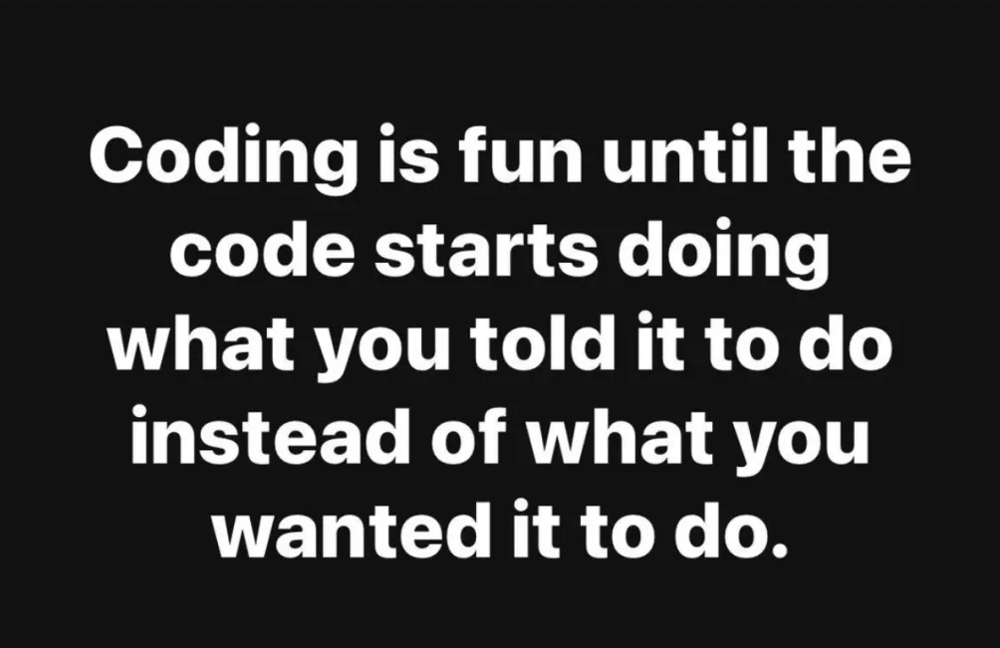
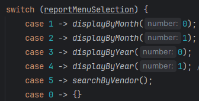

***
                                README
                                (please)

Biggest lessons I learned from this capstone project:

* The debugger is your best friend
* My own code is smarter than I am
* Being lazy is great

 Discovering new ways to be a lazy developer    
by reusing my methods for different reasons

*** 
## The Rundown
    
* Begin by reading from our transactions file
* Add each line to an ArrayList as a transaction
* Sort the objects in the ArrayList by date
* Prompt the user for various inputs
* Display their options, and navigate between menus
* Append any new transactions to both the file and ArrayList
* Allow the user to narrow down their searches with criteria
* Present all data and confirm inputs in a readable format
* Have the application continue to run until user chooses to exit